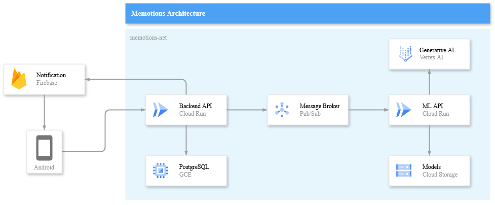

# Machine Learning API for Memotions

Machine Learning Service for the Memotions Application. This service provides APIs for accessing the Memotions machine learning models, the handling integration between machine learning models and the application's features. 


## Cloud Architecture
<div align="center">

</div>


## API Description
This API is built with FastAPI and served using Uvicorn. The service listens for Pub/Sub events to trigger its execution. Its primary task is to predict emotions from user journals and generate feedback based on them. We use a model developed by our ML team to predict the emotions, and a fine-tuned model with Vertex AI to generate the feedback. The results are then published to a Pub/Sub event.


## Tech Stack
- FastApi
- Tensorflow
- Pubsub
- Cloud Storage
- Vertex AI


## Documentation
You can access the full API documentation here:\
[**Memotions ML API Docs**](https://app.swaggerhub.com/apis/C014B4KY0471/memotions-ml-api/0.1.0)


## Getting Started

1. Clone the Repository
```sh
git clone https://github.com/memotions/ml-service.git
cd ml-service/
```

2. Create .env file
```sh
cp .env.example .env
vi .env
# add environment variables
```

3. Install Dependencies
```sh
pip install -r requirements.txt
```

4. Run the Server
```sh
# change host to localhost if want to try in your local
uvicorn app.main:app --host 0.0.0.0 --port 8000 --log-config logging_config.json
```